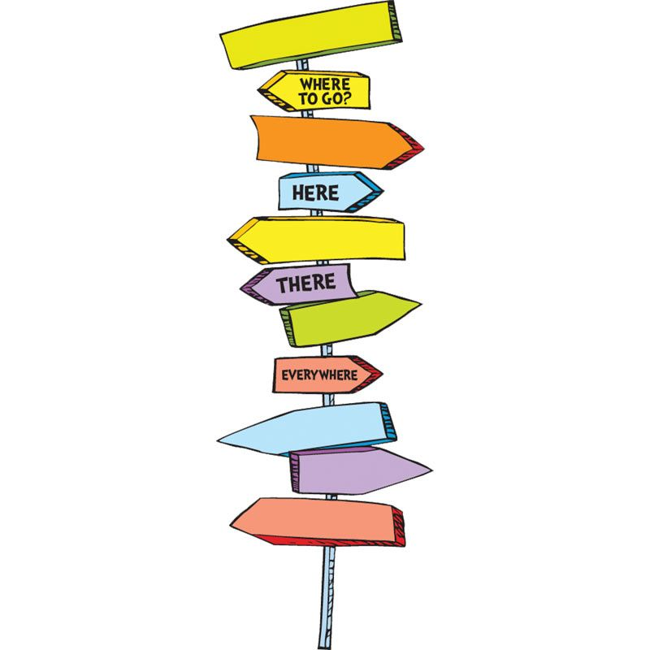

# Wanderland ✈️

> “You're off to Great Places!
> Today is your day!
> Your mountain is waiting,
> So... get on your way!” 
*― Dr. Seuss*

🤩 [Get Extension Here](https://chrome.google.com/webstore/detail/wanderland/mjmpogaohhmiggpipbojdciakhgjfedk)


I love planning travel and seeing new places to go in the world 🌍. There is a recurrent problem with internet wanderlust though. 😬 You probably know what I'm talking about if you've ever experienced something like this:

1. You decide your going travelling... 🥳 for whatever reason... to say *India*.
2. So what should you do there? Well you know you want to see some tigers! 🐯 So you google *"where to see tigers in India"*.
3. You get back results like this one: [holidify.com](https://www.holidify.com/pages/tiger-reserves-in-india-1333.html). It is a list of places that you've have never heard of before and have absolutely no point of reference for. :hear_no_evil:
4. So what you do is...
  * Copy the name of a place that sounds interesting to you from holidify.com
  * Open up another tab and navigate to google maps
  * Paste the name of the place and search to see where it is 🤦‍♂️
  * Repeat a-c **for every place you're interested in** 😑
5. Jot down in some notes somewhere the places your interested in to keep track of them
6. Send the notes to your friends you're travelling with so they can add to it. They have to repeat the process you went through...
7. Search across the web for more info on the places you're going to like pictures, facts, festivals ...

### Wanderland Solution (for steps 4-6)

4. Embedded Maps
  * A chrome extention that is instantly accessible across any webpage that allows you to see all the places mentioned on the page in a single embedded mini-map.
  * All the places on the page magically highlighted, allowing you to hover over them to see info about the place.
5. Add places of interest to your "wanderlist" by just clicking on the name of the place wherever it appears on the site.
6. Easily share your wanderlists with others, collaborate, assign the places dates and an ordering, and take notes on the places together all within a single workflow from any webpage. 😎
7. Have the software retrieve all the information you care about for each place automatically and make it easily accessible in one spot.



### Todo:
- We are using github issues to track to-dos for this project.

### How to Test:
- download/clone the repo
- go to ```chrome://extensions/``` in chrome browser
- toggle Developer Mode (switch in top right corner of page)
- click "Load Unpacked" (button in top left corner of page) and select the *dist* subolder inside the *wanderland* folder 
- go to any site with locations mentioned to see results pop up at the top of the page

### How to Build:
- Please make sure you have the most recent versions of npm and node installed.
- run ```npm install``` in the terminal in the project directory to install all dependencies
- run ```npm run build``` in the terminal in the project directory. As you develop, ```npm run watch``` might be a handy command to automatically rebuild upon a save of a source file.

### How to Contribute:
- So you like the idea and want to be part of it? Awesome! I'd recomend starting with any issues with the tag **good first issue**.
- We use eslint to maintain coding standards. Please make sure you have the **eslint** extention installed in vscode. You can also run the *Prettier* auto-formatter on your documents before submitting a PR. *Prettier* is a VS code extention as well.

Peace out and happy travelling ✌️ 😋
